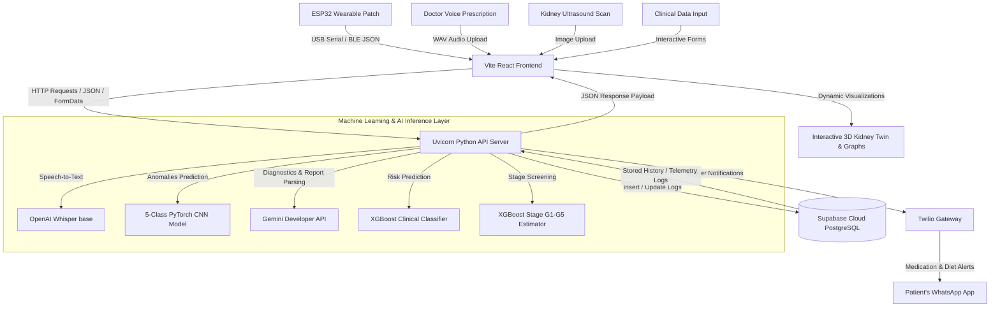
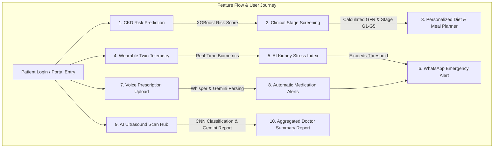
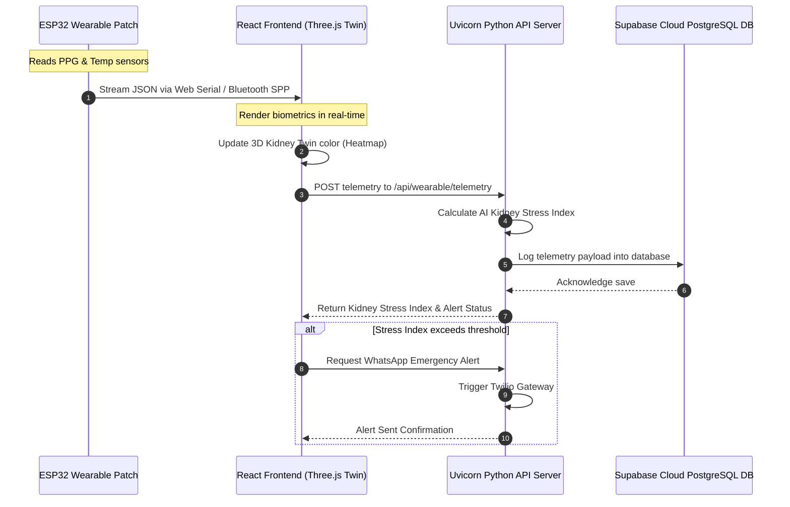

# NephroCare

**An AI-powered CKD care companion for early detection, personalized nutrition, and continuous monitoring.**

---

## Why NephroCare is Needed

Chronic Kidney Disease (CKD) is a global public health crisis, affecting over **850 million people worldwide** (more than double the number of people with diabetes, and 20 times the number of people with cancer or HIV/AIDS). 

CKD is a progressive, life-threatening condition often called a **"silent killer"**. Because early stages typically show no physical symptoms, up to **90% of individuals suffering from kidney damage are completely unaware** of their condition until their kidneys are on the brink of failure. By the time symptoms appear, the damage is often irreversible, requiring dialysis or a kidney transplant.

Managing kidney health is complex, requiring precise tracking of laboratory parameters, blood pressure, daily symptoms, and highly restrictive diets (limiting potassium, sodium, phosphorus, and protein). However, patients face severe barriers:
* Limited access to specialist nephrologists (especially in remote or underserved areas).
* Difficulty interpreting complex lab reports.
* A lack of daily, personalized nutritional guidance.
* High costs and invasive nature of traditional continuous monitoring.

**NephroCare** was built to break down these barriers by providing a non-invasive, accessible, and intelligent home-care cockpit.

---

## Solution Overview

NephroCare integrates machine learning risk prediction, clinical stage screening, AI-assisted ultrasound diagnostics, speech-to-text voice prescription parsing, and real-time wearable telemetry into a unified patient-centered ecosystem. It bridges the gap between clinical data and daily self-management for patients with Chronic Kidney Disease (CKD).

### Responsive Mobile-First Design
* The platform features a **fully responsive mobile cockpit layout**, optimized for smartphones and tablets.
* When viewed on a phone, the dashboard stacks sections fluidly, adjusts charts and dials, and fits the screen parameters natively (with no horizontal scrolling) to provide an accessible care experience on the go.

---

## System Architecture & Data Flow



---


## Core Features & Machine Learning Models Used

| Feature | Description | Models & Technology Stack |
|---|---|---|
| **CKD Risk Prediction** | Predicts the probability of CKD based on clinical metrics (creatinine, blood pressure, etc.). | **XGBoost Classifier** (`models/ckd_risk_prediction_model.joblib`) trained on clinical parameters. |
| **CKD Stage Screening** | Classifies kidney damage stages (G1 to G5) using lab values (eGFR, Urine ACR). | **XGBoost Classifier** (`models/ckd_stage_xgb.joblib`) with custom scaling pipelines. |
| **AI Ultrasound Diagnostics** | Analyzes kidney ultrasound images to class-predict structural anomalies. | **5-Class Custom PyTorch CNN** (`models/kidney_ultrasound_model.pth`) + **Gemini 2.5 Flash** for observations. |
| **Digital Kidney Twin** | Renders a 3D kidney avatar that reflects real-time biometric stress states. | **HTML5 Canvas / Three.js 3D rendering** driven by the real-time sensor streams. |
| **Voice Prescription Analyzer** | Transcribes doctor voice notes and parses them into medication & vital thresholds. | **OpenAI Whisper (base model)** for transcription + **Gemini API** for clinical entity parsing. |
| **Food Safety & Meal Planner** | Analyzes food safety levels and creates kidney-friendly diet guides. | **Gemini Developer API** + **Indian Foods Dataset** matching engine. |
| **WhatsApp Health Assistant** | Sends proactive reminders for medications, diet adherence, and checkups. | **Twilio Messaging API** (WhatsApp sandbox gateway). |
| **Monitoring Dashboard** | Consolidated view showing health logs, lab historical trends, and alerts. | **Vite React SPA** dashboard with live telemetry socket linkages. |

### Feature Flow & User Journey



---

## Database Schema & Datasets Used

### Database Entity-Relationship (ER) Diagram
This diagram shows the PostgreSQL table relations for user authentication, clinical profiles, symptom tracking, predictions, ultrasound logs, and food checks:

```mermaid
erDiagram
    nephrocare_users ||--o{ nephrocare_sessions : "has active"
    nephrocare_users ||--|| nephrocare_user_profiles : "possesses clinical"
    nephrocare_users ||--o{ nephrocare_predictions : "generates risk"
    nephrocare_users ||--o{ nephrocare_ultrasound_scans : "logs ultrasound"
    nephrocare_users ||--o{ nephrocare_symptom_logs : "records symptom"
    nephrocare_users ||--o{ nephrocare_food_checks : "submits food safety"

    nephrocare_users {
        varchar id PK "Hex User ID"
        varchar name "Profile Display Name"
        varchar email "Unique Registered Email"
        varchar password_hash "SHA-256 Hash"
        timestamp created_at "Registration Time"
        varchar oauth_provider "OAuth Provider (Google/Null)"
    }

    nephrocare_sessions {
        varchar token PK "Hex Session Token"
        varchar user_id FK "References users.id"
        varchar email "User Email"
        timestamp created_at "Login Time"
    }

    nephrocare_user_profiles {
        varchar user_id PK, FK "References users.id"
        varchar phone "Patient Phone Number"
        varchar dob "Date of Birth"
        varchar gender "Gender Info"
        varchar ckd_stage "Stage (G1-G5)"
        varchar nephrologist "Doctor Name"
        varchar blood_type "Blood Group"
        varchar emergency_contact "Emergency Phone"
    }

    nephrocare_predictions {
        serial id PK "Prediction Entry ID"
        varchar user_id FK "References users.id"
        timestamp timestamp "Calculation Time"
        jsonb data "Input metrics & calculated risk"
    }

    nephrocare_ultrasound_scans {
        serial id PK "Scan Entry ID"
        varchar user_id FK "References users.id"
        timestamp timestamp "Scan Logging Time"
        jsonb data "Image base64 & ML observations"
    }

    nephrocare_symptom_logs {
        serial id PK "Symptom Log Entry ID"
        varchar user_id FK "References users.id"
        timestamp timestamp "Logging Time"
        jsonb data "Symptom severity map"
    }

    nephrocare_food_checks {
        serial id PK "Food Check Entry ID"
        varchar user_id FK "References users.id"
        timestamp timestamp "Check Time"
        jsonb data "Analyzed food item & safety status"
    }
```



### Processed Datasets


### 1. UCI Chronic Kidney Disease Dataset
- **Source:** UCI Machine Learning Repository
- **Processed file:** `data/processed/uci_ckd.csv`
- **Records:** 400 patients
- **Use:** CKD risk prediction model

### 2. NHANES 2017–March 2020 Dataset
- **Source:** CDC NHANES public dataset
- **Processed file:** `data/processed/nhanes_ckd.csv`
- **Records:** 9,693 adults
- **Use:** CKD stage screening model
- **Generated labels** (from eGFR and urine ACR):
  - No CKD screen: 6,644
  - CKD screen positive: 1,521
  - Insufficient kidney data: 1,528

### 3. Indian CKD Foods Dataset
- **Processed file:** `data/processed/indian_ckd_foods.csv`
- **Records:** 527 foods
- **Use:** Food safety checks, food recommendations, and meal planning
- Includes Indian food names/categories with protein, energy, potassium, phosphorus, and sodium content, plus CKD safety labels.

---

## Wearable Patch Integration (Hardware)

NephroCare incorporates a physical wearable patch to track biometrics in real-time. It streams telemetry directly into the monitoring cockpit to feed the AI Kidney Stress Index.

### Wearable Telemetry & Alert Sequence
This diagram shows the step-by-step telemetry transmission and the real-time threshold check flow:




### Hardware Components:
* **ESP32 DevKit V1**: Low-power microcontroller with onboard Bluetooth and USB Serial.
* **MAX30102 PPG Sensor**: Tracks heart rate (HR), heart rate variability (HRV), and blood oxygen levels (SpO2).
* **DS18B20 Temp Probe**: Waterproof digital thermistor tracking skin temperature.

### Telemetry Output Format:
```json
{
  "temperature": 30.5,
  "heartRate": 72,
  "spo2": 98,
  "fingerDetected": true,
  "ir": 61200
}
```

* **Connecting the Patch**: Connect the ESP32 via Micro-USB or pair it over Bluetooth under the name **`NephroCarePatch`** (using Classic Bluetooth Serial SPP).
* For details, refer to **[docs/wearable.md](file:///home/vimla/Documents/nephrocare/docs/wearable.md)**.

---

## Running the Application Locally

### Prerequisites
* Python 3.10+
* Node.js 18+
* Supabase Cloud Database (or local PostgreSQL instance, configured in `.env`)

### Step 1: Environment Setup
Copy the template `.env.example` to a new `.env` file and fill in your API keys (Gemini, Google OAuth, Twilio, database connection string):
```bash
cp .env.example .env
```

### Step 2: Install Python Dependencies & Extract Datasets
Create a virtual environment, install dependencies, and run the dataset setup:
```bash
python3 -m venv .venv
source .venv/bin/activate  # On Windows: .venv\Scripts\activate
pip install -r requirements.txt
python scripts/extract_datasets.py
```

### Step 3: Run the Application (Unified Startup Script)
You can boot both the Python API backend and the Vite React frontend concurrently:
```bash
bash scripts/run_nephrocare_demo.sh
```

Once running:
* **Frontend Portal**: Open [http://localhost:5175/](http://localhost:5175/) in your browser.
* **Backend Uvicorn API**: Active at [http://localhost:8000/](http://localhost:8000/).

#### Alternative: Running Separately
If you want to run the servers in separate terminals:
* **Start Backend**: `.venv/bin/python api/nephrocare_api.py`
* **Start Frontend**: `cd frontend && npm install && npm run dev`

---

## Target Users

1. **High-Risk Individuals**: People with diabetes, hypertension, obesity, or a family history of renal disease who want to screen early and predict their risk index before damage escalates.
2. **Diagnosed CKD Patients (Stages 1–5)**: Patients who need daily support managing their diet, logging their biometric telemetry, and tracking lab value trends over time.
3. **Caregivers & Family Members**: Relatives who want to receive automated early warning alerts (via WhatsApp) and monitor the patient's status remotely.
4. **Clinicians & Remote Health Assistants**: Providers looking for an aggregated diagnostic overview and a structured doctor summary report to make clinical consultations more efficient.

---

## Disclaimer

All outputs, screenings, and alerts generated by the models and biosensors are intended for **educational tracking and proxy awareness only** - they are **not confirmed medical diagnoses**. NephroCare is designed to support and facilitate patient-doctor communication, not to replace professional medical treatment.