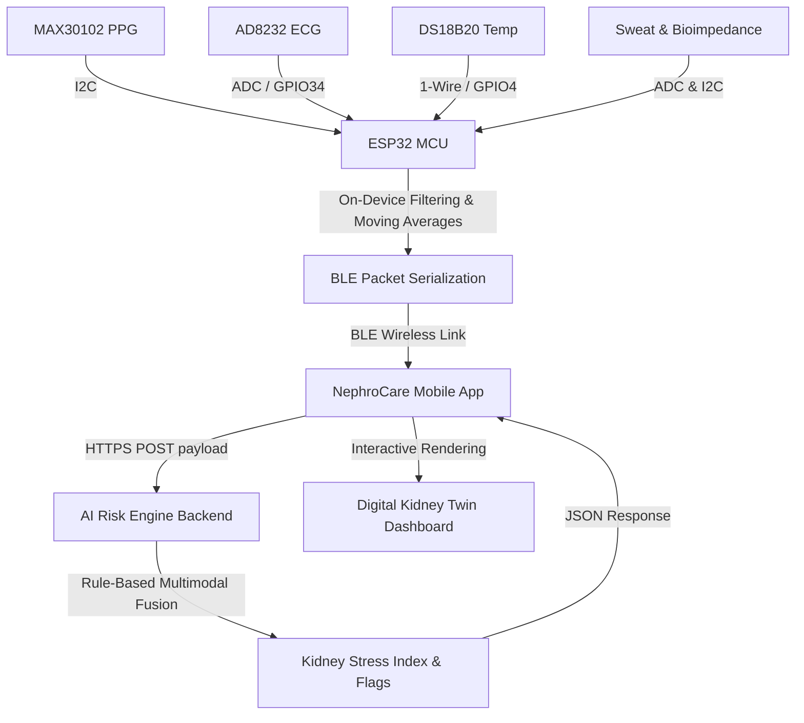

# NephroCare Wearable Patch — Hardware & AI Risk Engine Architecture

## 1. Why this hardware design exists

Conventional CKD diagnosis relies on blood tests (creatinine) and urine tests (albumin) — both invasive or non-real-time, lab-dependent, and prone to sample contamination or low quantification accuracy. The wearable approach instead samples peripheral biofluids (interstitial fluid and sweat) continuously and non-invasively at the skin surface, streaming data through a phone to a cloud-based "Digital CKD clinic" for remote monitoring and preventive care.

NephroCare's hardware is built around this same blood/urine → wearable shift, but scoped honestly to what a hackathon-stage, non-lab-grade patch can actually deliver: **physiological proxy signals and trend detection**, not lab-equivalent biomarker quantification.

---

## 2. System block diagram

```
┌────────────────────────────────────────────────────────────┐
│                     WEARABLE PATCH (on-body)                │
│                                                              │
│  MAX30102 (PPG)   AD8232 (ECG)   DS18B20 (Temp)             │
│       │                │              │                     │
│  Sweat electrode    Bioimpedance (AD5933)                   │
│       │                │                                    │
│       └────────┬────────┴──────────────┘                     │
│                ▼                                            │
│            ESP32 DevKit V1                                  │
│      (sampling, filtering, JSON packaging)                  │
└────────────────────┬─────────────────────────────────────────┘
                      │ BLE / NFC (short-range)
                      ▼
              ┌───────────────┐
              │  Mobile App    │
              └───────┬───────┘
                      │ Wi-Fi / Cellular / 5G
                      ▼
          ┌────────────────────────┐
          │  Cloud: Data Mgmt + AI  │
          │  (storage, QC, ML risk  │
          │   scoring, anomaly det) │
          └───────────┬────────────┘
                       ▼
          ┌────────────────────────┐
          │  Clinician Dashboard /  │
          │  Patient App (alerts,   │
          │  risk index, trends)    │
          └────────────────────────┘
```

This mirrors the end-to-end framework described in the literature: wearable biosensing → secure data transmission (BLE/NFC short-range, Wi-Fi/cellular long-range, end-to-end encrypted) → cloud data management and AI/ML analytics (feature extraction, multimodal fusion, trend analysis, risk prediction, anomaly detection) → clinical integration (dashboards, EHR/HIS interoperability) → patient outcomes.

---

## 3. Sensor modules and what each one actually proxies for

| Module | Part | Signal | What it really tells you |
|---|---|---|---|
| PPG / Heart Rate | MAX30102 | Optical pulse waveform | HR, HRV — sympathetic stress proxy |
| ECG | AD8232 | Cardiac electrical waveform | Waveform anomalies that *can* correlate with elevated potassium (hyperkalemia signature), not a direct K⁺ reading |
| Skin Temperature | DS18B20 | Thermistor | Local vasodilation / inflammation proxy |
| Sweat Conductivity | Electrode pair (analog) | Ionic conductivity | Na⁺/K⁺ *trend* proxy, not absolute concentration |
| Bioimpedance | AD5933 | Tissue impedance spectroscopy | Extracellular fluid volume / hydration proxy |

This sensor selection deliberately follows the three sensing modality families used across real wearable CKD research — electrochemical, optical/colorimetric, and field-effect transistor (FET) sensing — plus a fourth, physiological category (bioimpedance) for fluid-status context, all of which combine into the multimodal sensing fusion that the field considers necessary because CKD is a multifactorial disease, not one with a single dominant biomarker.

### Why we don't claim direct creatinine/urea/cystatin C sensing
Real lab-grade wearable platforms achieve this using purpose-built electrochemical and optical biosensor architectures — colorimetric wearable patches with pH-indicator dye arrays calibrated against known creatinine/urea concentrations, ISF-based lateral-flow immunoassay strips for cystatin C, microneedle-type sensors that physically access interstitial fluid in the dermis, and specialized extraction methods (iontophoresis/electroosmotic flow via pilocarpine-driven sweat or ISF extraction) paired with highly sensitive transducers like OECTs (organic electrochemical transistors).

None of that specialized biochemistry hardware is in our BOM. Our sensors are physiological/physical (PPG, ECG, temp, bulk conductivity, impedance) — they're proxies, not assays. This is exactly why our backend's risk engine is rule-based and trend-oriented rather than presenting absolute mg/dL-style numbers.

---

## 4. ESP32 pin map

| Sensor Pin | ESP32 GPIO | Bus | Function / Role |
|---|---|---|---|
| MAX30102 SDA | GPIO 21 | I2C | Optical PPG Data Line |
| MAX30102 SCL | GPIO 22 | I2C | Optical PPG Clock Line |
| AD8232 OUTPUT | GPIO 34 | Analog (ADC) | Cardiac Electrical Output |
| AD8232 LO+ | GPIO 25 | Digital | Lead-off Detection Positive |
| AD8232 LO- | GPIO 26 | Digital | Lead-off Detection Negative |
| DS18B20 DATA | GPIO 4 | 1-Wire (+4.7kΩ pull-up) | Temperature Data Line |
| Sweat electrode OUT | GPIO 35 | Analog (ADC) | Bulk sweat conductivity readout |
| AD5933 SDA | GPIO 32 | I2C | Impedance Spectroscopy SDA |
| AD5933 SCL | GPIO 33 | I2C | Impedance Spectroscopy SCL |
| Battery (Li-Po 3.7V) | VIN | Power | Input power supply |
| Common ground | GND | — | Common reference ground |

---

## 5. Data acquisition & transmission pipeline

1. **Sample**: ESP32 polls each sensor at fixed intervals (2s default for the bundled JSON packet; PPG sampled continuously in the background for HR/HRV peak detection).
2. **Condition**: lightweight on-device filtering — moving average for temperature, threshold-based peak detection for PPG, lead-off detection gating for ECG — before transmission, to reduce noise and battery draw.
   - *PPG/ECG*: Bandpass filtering (0.5Hz to 40Hz) is done in the ESP32 background thread to reduce motion artifact.
   - *Temperature & Conductivity*: 10-sample moving average filter is applied locally to output a smoothed value once per second.
3. **Package**: sensor values bundled into a single JSON payload per cycle.
4. **Transmit**: BLE notify to the paired mobile app (short-range, low-power); app optionally relays to cloud over Wi-Fi/cellular for the full AI/ML analytics layer.
5. **Encrypt**: end-to-end encrypted transmission, consistent with the cross-cutting data-security requirement in any clinically-oriented digital health pipeline (HIPAA/GDPR-aware design, even at hackathon stage).



---

## 6. AI Risk Engine & Multimodal Fusion Rules

Rather than evaluating biomarkers in isolation, the backend fuses physiological metrics to generate a composite **Kidney Stress Index (0–100)** and categorizes risk into **Low, Moderate, or High** states.

```text
       PPG / HRV           Sweat Conductivity          Bioimpedance              AI Risk Engine
 ┌───────────────────┐    ┌───────────────────┐    ┌───────────────────┐    ┌──────────────────────┐
 │ HRV ↓             │───>│ Na+/K+ Proxy ↑    │───>│ Impedance ↓       │───>│ Kidney Stress Index  │
 │ (Sympathetic rise)│    │ (Electrolyte leak)│    │ (Fluid overload)  │    │ 0 - 100 Risk Score   │
 └───────────────────┘    └───────────────────┘    └───────────────────┘    └──────────────────────┘
           │                        │                        │                         │
           ▼                        ▼                        ▼                         ▼
   Dehydration Alert        Hyperkalemia Pattern      Fluid Retention Flag      Clinical Warnings
   (HRV + Conductivity)    (Conductivity + ECG T-w)    (Impedance + Temp)      ("10-30 min lag note")
```

### 1. Kidney Stress Index (0–100)
Formulated as a weighted combination of sympathetic activation (HRV drop), skin temperature trend, sweat conductivity, and bioimpedance drift:
$$\text{Stress Index} = 0.35 \times (\text{HRV Deviation}) + 0.25 \times (\text{Sweat Conductivity}) + 0.25 \times (\text{Bioimpedance Drift}) + 0.15 \times (\text{Temp Rise})$$

### 2. Dehydration / Electrolyte Imbalance Risk
- **Trigger**: Sweat conductivity exceeds baseline by $>25\%$ AND HRV decreases by $>15\%$.
- **Flag**: `"High Dehydration Risk & Electrolyte Loss"`
- **Actionable Guidance**: Recommend small, controlled sips of safe water; note that sweat sodium leaks precede clinical dehydration flags.

### 3. Fluid Overload / Retention Alert
- **Trigger**: Bioimpedance impedance values show a downward trend over 3 days (representing increased extracellular fluid volume) coupled with elevated skin temperature.
- **Flag**: `"Cardio-Renal Fluid Overload Trend"`
- **Actionable Guidance**: Advise consultation on fluid allowance; flag potential edema.

### 4. ECG Hyperkalemia Pattern Flag (The "Wow" Feature)
- **Trigger**: ECG sensor detects peaked T-waves where the T-to-QRS amplitude ratio exceeds `0.50` (symptomatic of early electrolyte disruption) while sweat conductivity rises into high electrolyte zones.
- **Flag**: `"ECG Alert: Hyperkalemic T-wave Pattern Detected"`
- **Actionable Guidance**: *Warning: This is not a diagnosis. Pattern suggests potential elevated potassium levels. Limit high-potassium foods and check with your physician immediately.*

---

## 7. Known hardware limitations

- **Sweat composition variability**: sweat rate, skin temperature, hydration state, and individual physiology all affect conductivity readings, so absolute concentration claims from a single electrode pair are not defensible — only trend monitoring is.
- **Temporal lag**: sweat-derived signals lag blood by roughly 10–30 minutes, and ISF-derived signals lag by roughly 5–15 minutes — relevant if you ever add a microneedle ISF sensor.
- **Motion artifacts**: bioimpedance and PPG readings degrade with movement; mitigate with simple motion/activity gating in firmware (e.g., flag readings taken during high accelerometer variance as lower-confidence).
- **Biofouling / drift**: any future electrochemical sensor added to this stack (enzymatic urea sensor, ion-selective electrodes) will face biofouling and signal drift over continuous wear — a known, unresolved field-wide limitation, not unique to this build.

---

## 8. Bill of materials (BOM) summary

| Component | Approx. role | Required for MVP demo? |
|---|---|---|
| ESP32 DevKit V1 | Central MCU + BLE | Yes |
| MAX30102 | PPG/HR/HRV | Yes |
| DS18B20 | Skin temperature | Yes |
| Sweat conductivity electrodes | Electrolyte trend proxy | Yes (can simulate with potentiometer if unavailable) |
| AD8232 | ECG | Optional, high pitch-impact |
| AD5933 | Bioimpedance | Optional, can simulate values |
| Li-Po 3.7V + TP4056 | Power + USB-C charging | Yes |
| Medical tape / flexible PCB enclosure | Physical patch form factor | For physical demo only |

---

## 9. Defense Strategy: Answering Judge Questions

### Question A: "How do you account for sweat rate changes?"
* **Answer**: We measure sweat rate indirectly through local thermal dissipation using the DS18B20 skin temperature sensor paired with sweat conductivity. Furthermore, we calibrate all sweat concentration trends against the patient's personalized baseline during rest periods to factor out environmental changes. We never state absolute concentrations, only percentage deviations.

### Question B: "What about sensor drift and biofouling?"
* **Answer**: In a real clinical setting, electrochemical sweat sensors suffer from enzymatic degradation and skin lipid buildup. The AD5933 (bioimpedance) and MAX30102 (PPG) are optical/electrical and do not suffer from biofouling. For sweat, we restrict sensor use to short-term, disposable adhesive patches (24-hour lifespan) rather than permanent wear.

### Question C: "Is it safe to advise patients based on sweat?"
* **Answer**: Absolutely. Our software includes a critical safety framework. Alerts are designated as **"physiological trend flags"** rather than diagnostic medical alerts, and we explicitly display the literature-documented **10–30 minute sweat lag** in the user's dashboard to prevent patient confusion.

---

## 10. Where this plugs into the rest of the stack

- **Firmware** → `nephrocare_firmware.ino` (BLE JSON packets)
- **Backend** → `nephrocare_backend.py` (`/ingest` endpoint, rule-based risk scoring)
- **Frontend** → React dashboard consuming `/history/{device_id}` for the 7-day Digital Kidney Twin trend view

This hardware doc is the bridge piece — it's what you hand a judge or teammate who asks *"wait, how does the physical sensor data actually become the risk score on screen?"*
